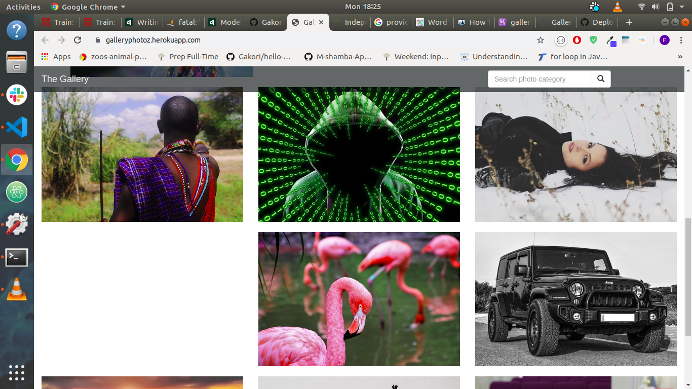
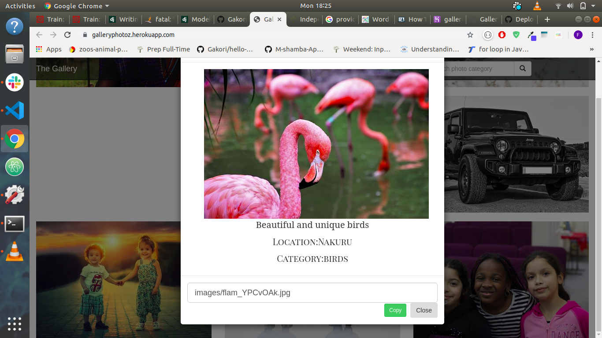

##  TITLE
 GALLERY

## AUTHOR
 Built By Faith Gakori

## PROJECT DESCRIPTION
    The project is for displaying photos created using django.

## SCREENSHOTS

## USER STORIES

* View different photos that interest me.
* Click on a single photo to expand it and also view the details of the photo. The photo details must appear on a modal within the same route as the main page.
* Search for different categories of photos. (ie. Travel, Food)
* Copy a link to the photo to share with my friends.
* View photos based on the location they were taken.

## SetUp / Installation Requirements
  Clone the repo by running:
*   git clone https://github.com/Gakori/Gallery.git

 Navigate to the project directory;
*   cd Gallery

 Create a virtual environment and activate it
*   python3 -m venv virtual
*   source virtual/bin/activate

  Create a database
  using postgress, type the following commands;
*   $psql

Then run the command to create a new database
*   #create database gallery

 Install dependencies
*   pip install -r requirements.txt

 Create database migrations
*   python3 manage.py makemigrations photoz
*   python3 manage.py migrate

 Run the app
*   python3 manage.py runserver

## TECHNOLOGIES USED
* Django
* Python
* Bootstrap
* Html
* Css
* Postgres

## CONTACT INFORMATION
 For email reach us through faithgakori506@gmail.com

## LICENCE
MIT ©2019 Faith Gakori